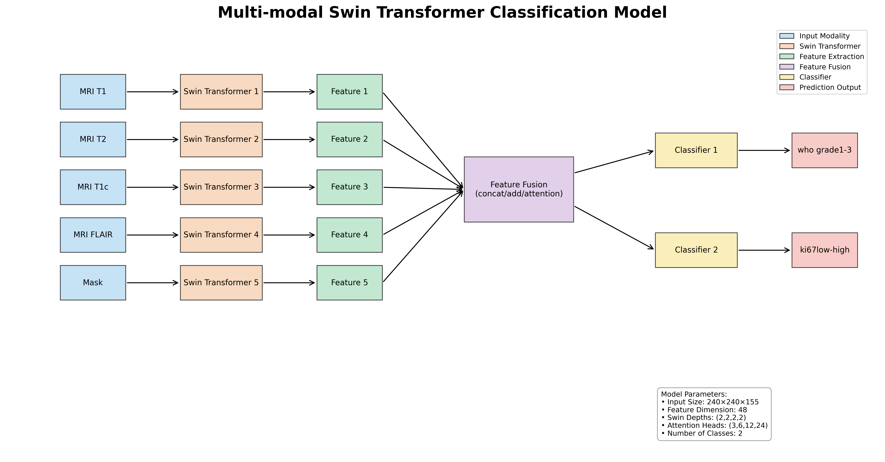

# MRI_swintransformer_classify
A multi-modal Swin Transformer model for classifying Ki-67 index and WHO grade in meningiomas

## Project Overview

This project utilizes multi-modal MRI data (T1, T2, T1c, FLAIR) and tumor segmentation masks to build a deep learning model based on Swin Transformer for automatic meningioma classification. The model simultaneously predicts two important clinical indicators:
1. Ki-67 proliferation index (low/high)
2. WHO tumor grade (grade 1-3)

## Model Architecture

The model adopts a multi-modal learning approach, constructing separate Swin Transformer networks for each input modality (4 MRI sequences and 1 segmentation mask). It extracts modality-specific features, integrates them through feature fusion strategies, and finally predicts Ki-67 index and WHO grade through two separate classifiers.

### Key Features

- **Multi-modal Input**: Processes T1, T2, T1c, FLAIR MRI sequences and tumor segmentation mask simultaneously
- **Modality-specific Feature Extraction**: Builds individual Swin Transformer for each modality to extract modality-specific features
- **Flexible Feature Fusion**: Supports multiple feature fusion strategies (concatenation, addition, attention mechanism)
- **Multi-task Learning**: Simultaneously predicts Ki-67 index and WHO grade

### Technical Details

- Input Size: 240×240×155
- Feature Dimension: 48
- Swin Transformer Depths: (2,2,2,2)
- Attention Heads: (3,6,12,24)
- Number of Classes: 2 classes per task
